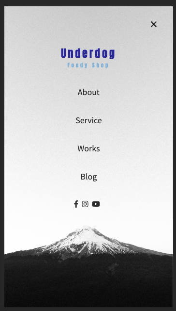
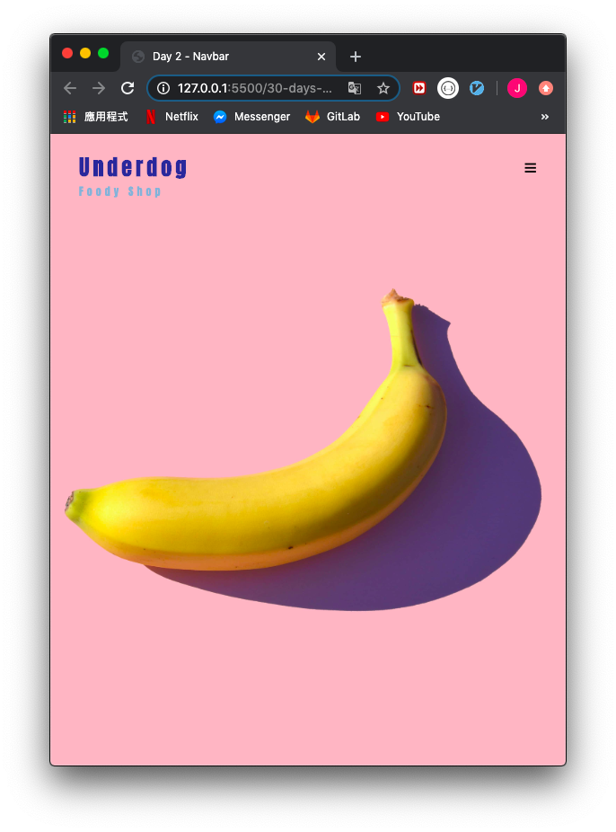
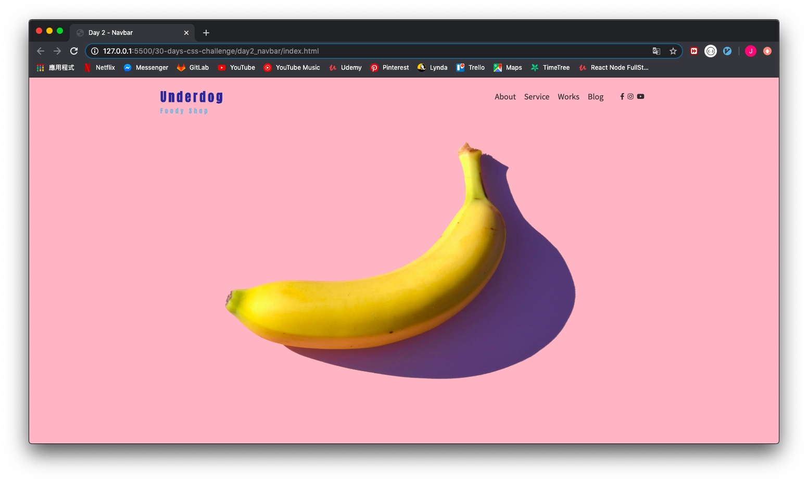
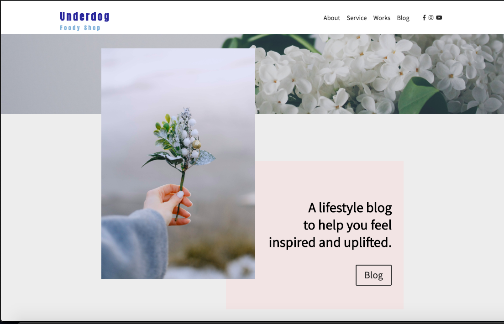

## CSS 30 DAYS CHALLENGE

> Practicing is the best way to learn!!
> Each day I will post a small component that I build, such as navbar, blog post layout, footer, etc.

#### DAY1 - Mobile First Blog Post Template

|            Mobile Screen             |              iPad Screen               |          Laptop Screen           |
| :----------------------------------: | :------------------------------------: | :------------------------------: |
|  |  |  |

---

### DAY2 - Responive Fullscreen navbar

|            Mobile Screen             |              iPad Screen               |          Laptop Screen           |
| :----------------------------------: | :------------------------------------: | :------------------------------: |
|  |  |  |

---

### DAY3 - Banner Below Enhanced Section

