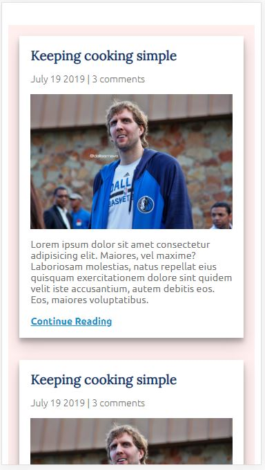
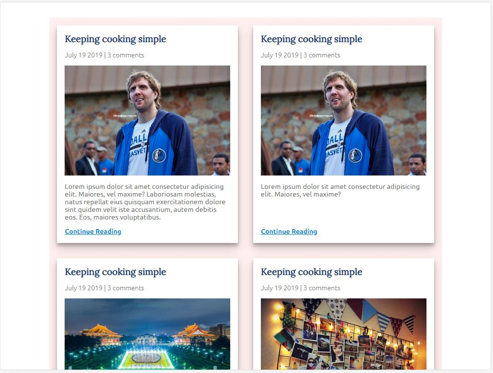
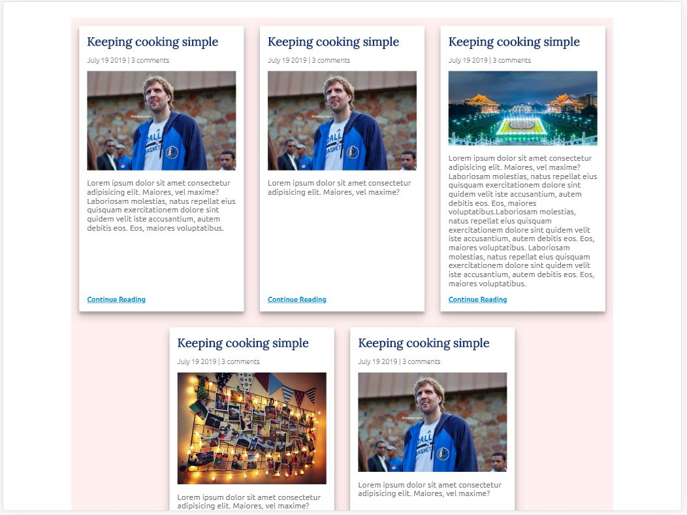

## CSS 30 DAYS CHALLENGE

> Practicing is the best way to learn!!
> Each day I will post a small component that I build, such as navbar, blog post layout, footer, etc.

#### DAY1 - Mobile First Blog Post Template

---